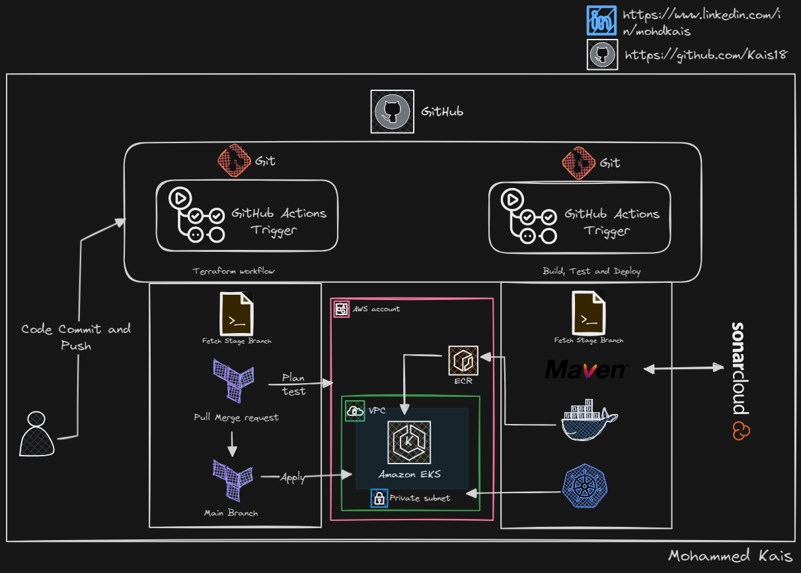

# Application services Kubernetes project
This is a Repository for front end services  with complete CICD using the git actions, the back end is [here](https://github.com/Kais18/Terraform_backend_CICD_AWS) for AWS services using Terraform.
Any changes commited to main branch will be detected and triggered by Git Actions. 
[Click Here](https://github.com/Kais18/Terraform_backend_CICD_AWS) for backend Repository.

**Complete Services Used**:

- AWS EKS (Elastic Kubernetes Services)
- AWS ECR ( Elastic Container Registery)
- AWS VPC ( Virtual Private Cloud )
- Docker
- Kubernetes Helm
- GitHub Actions
- Maven
- SonarCloud
- Terraform

# Prerequisites
#####
- JDK 11
- Maven 3
- MySQL 8 

# Technologies 
- Spring MVC
- Spring Security
- Spring Data JPA
- Maven
- JSP
- MySQL
# Database
Here,we used Mysql DB 
MSQL DB Installation Steps for Linux ubuntu 14.04:
- $ sudo apt-get update
- $ sudo apt-get install mysql-server

Then look for the file :
- /src/main/resources/db_backup.sql
- db_backup.sql file is a mysql dump file.we have to import this dump to mysql db server
- > mysql -u <user_name> -p accounts < db_backup.sql
